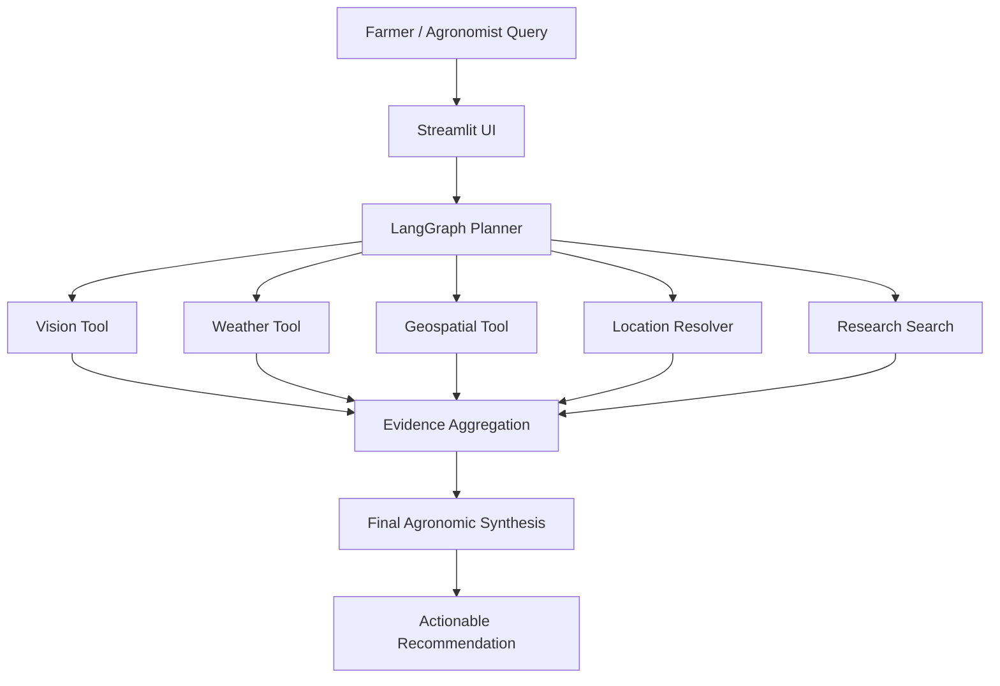

# 🌱 Prithvi Agro Crop Assistant

<p align="center">
  
</p>

<p align="center">
  <a href="https://www.python.org/">
    
  </a>
  <a href="https://streamlit.io/">
    
  </a>
  <a href="https://langchain-ai.github.io/langgraph/">
    
  </a>
  <a href="https://www.sentinel-hub.com/">
    
  </a>
  <a href="https://open-meteo.com/">
    
  </a>
</p>

> AI-powered crop intelligence for farmers, agronomists, and field managers — combining image analysis, weather insights, geospatial diagnostics, and evidence-backed agronomic guidance in one workflow.

<p align="center">
  <a href="C:/Users/MCT/Downloads/Prithvi_Agro_AI_paper.pdf">
    
  </a>
</p>

<p align="center">
  <strong>This project is grounded in a research-backed agricultural AI study and has been designed around a well-structured, evidence-driven crop intelligence framework.</strong>
</p>

## Overview

Prithvi Agro Crop Assistant is a research-oriented agricultural decision support system that helps interpret crop stress, field conditions, and management risks using multiple evidence sources. The system can accept a natural language query, a plant image, and optional geolocation details, then orchestrate a multi-step reasoning workflow to provide actionable agronomic advice.

This project is designed for prototype and research use. It is not a substitute for field inspection, laboratory diagnostics, or certified agronomic advice.

---

## Why this project matters

Modern agriculture depends on timely insights from several disconnected sources:

- plant health imagery
- field-level weather and climate conditions
- vegetation and soil trend analysis from Earth observation data
- research documents and agronomic references

Prithvi Agro Crop Assistant unifies these signals into a single intelligent assistant. Instead of forcing a farmer to manually browse separate tools, the assistant reasons across them and returns a clear, context-aware recommendation.

---

## System architecture



### Core capabilities

- Plant image classification for crop stress and disease signals
- Weather analysis for current conditions, forecast risk, and historical trends
- Satellite-based vegetation monitoring using Sentinel-2-derived indicators
- Location normalization for field and region-based queries
- Research-backed answer synthesis using agricultural references and web search
- Streamed assistant progress and answer generation in a clean UI

---

## Feature highlights

### 🌾 Field-aware intelligence
The system interprets not just the crop issue in isolation, but also its surrounding conditions: weather, field history, growth stage, and environmental stress signals.

### 🧠 Multi-tool planning
Rather than relying on a single model call, the assistant plans and executes relevant tools in sequence, then combines the evidence before producing a final answer.

### 📡 Remote sensing and agronomy
By integrating weather and geospatial analytics, the system can support decisions such as:

- stress detection during abnormal conditions
- crop vigor comparison across date windows
- risk evaluation after rainfall, heatwaves, or dry spells
- seasonal trend interpretation

### 🧪 Research support
The assistant can retrieve agricultural references and scientific findings to ground its recommendations, making responses more evidence-informed and operationally meaningful.

---

## Workflow

```text
User question + optional image/location
                │
                ▼
         Agent planning layer
                │
   ┌────────────┼────────────┐
   │            │            │
   ▼            ▼            ▼
Vision      Weather     Geospatial
   │            │            │
   └───────┬────┼────────────┘
           │
           ▼
    Research + location lookup
           │
           ▼
    Evidence synthesis
           │
           ▼
    Final field recommendation
```

The system keeps concise summaries of completed tool calls while preserving full trace details for the final answer, improving efficiency and interpretability.

---

## Project structure

```text
.
├── main.py                  # Streamlit web interface and upload handling
├── agronomist_agent.py      # UI-facing streaming agent wrapper
├── finetuning-clip.py       # Optional CLIP fine-tuning helper
├── requirements.txt         # Python dependencies
├── .gitignore               # Repository ignore rules
├── README.md                # Project documentation
├── agent/
│   ├── __init__.py
│   ├── graph.py             # LangGraph planner and execution flow
│   ├── prompt.py            # Agent guidance and response templates
│   └── state.py             # Shared graph state structures
├── tools/
│   ├── __init__.py
│   ├── geocoding_tool.py    # Location lookup and coordinate resolution
│   ├── geospatial_tool.py   # Sentinel-2 and vegetation analysis
│   ├── search_tool.py       # Research and web retrieval logic
│   ├── tool_schemas.py      # Schema validation for tool inputs
│   ├── vision_tool.py       # Crop image classification integration
│   └── weather_tool.py      # Weather analysis and interpretation
└── .github/
    └── workflows/
        └── keep-alive.yml
```

---

## Installation

### 1) Create a virtual environment

```bash
python -m venv .venv
```

#### Windows PowerShell

```powershell
.\.venv\Scripts\Activate.ps1
```

#### macOS / Linux

```bash
source .venv/bin/activate
```

### 2) Install dependencies

```bash
pip install -r requirements.txt
```

### 3) Run the app

```bash
streamlit run main.py
```

---

## Environment configuration

Create a `.env` file in the project root before running the app.

```dotenv
# Required for the model orchestration layer
GROQ_API_KEY=your_groq_key
GROQ_API_KEY_BACKUP=your_secondary_groq_key
GROQ_MODEL=llama-3.3-70b-versatile

# Research and location tools
TAVILY_API_KEY=your_tavily_key
OPENWEATHER_API_KEY=your_openweather_key

# Optional geospatial pipeline
SENTINEL_CLIENT_ID=your_sentinel_client_id
SENTINEL_CLIENT_SECRET=your_sentinel_client_secret

# Optional vision classification service
VISION_API_URL=https://your-vision-service.example/classify
VISION_API_TIMEOUT_SECONDS=30
AGRIBOT_MAX_IMAGE_MB=8

# Optional fallback synthesis provider
OPENROUTER_API_KEY=your_openrouter_key
```

### Notes

- Open-Meteo can be used without an API key for weather access.
- Sentinel Hub credentials are needed only when geospatial analytics are active.
- Temporary uploads are created under `.streamlit_tmp/` during runtime.

---

## Example questions

- “What disease could be causing yellowing and spots on my maize leaves?”
- “Should I worry about moisture stress in my wheat field this week?”
- “Compare plant vigor before and after heavy rainfall in this field.”
- “What are the best agronomic interventions for powdery mildew on grapes?”
- “I uploaded a tomato leaf image — can you help diagnose the issue?”

---

## Usage flow

1. Enter a field or crop question in the chat interface.
2. Optionally attach a leaf or plant image.
3. Provide a location or coordinates if relevant.
4. The agent selects the right tools to gather evidence.
5. Results are combined into a practical recommendation.
6. A full execution trace remains available for inspection.

---

## Operational considerations

- Image-based diagnoses are decision-support signals, not definitive diagnoses.
- Geospatial and weather models depend on available cloud-free observations and API uptime.
- Recommendations should be validated against on-ground field inspection and agronomic expertise.
- The prototype is best suited for experimentation, research, and applied prototyping.

---

## Roadmap

- Improve crop disease classification confidence and explainability
- Add more robust local field history support
- Extend geospatial analysis to longer time series and anomaly detection
- Add region-aware advisory templates for major crop types
- Expand tool integrations for irrigation, soil, and pest alerts

---

## Contributing

Contributions are welcome. If you want to improve the project:

1. Fork the repository
2. Create a feature branch
3. Make a focused change
4. Validate the workflow locally
5. Submit a pull request with a clear summary

---

## License

No license has been declared in the project yet. Before distributing or contributing externally, add a proper open-source license such as MIT or Apache 2.0.

---

## Attribution

This project builds on open-source and API-driven components including:

- Streamlit
- LangGraph
- LangChain
- Groq
- Open-Meteo
- Sentinel Hub
- Tavily
- OpenWeather
- CLIP-based crop image analysis workflows

Please ensure that any reuse or distribution respects the licensing and terms of the upstream services and tools.

<p align="center">
  <sub>Built for smart agriculture, resilient decision-making, and evidence-driven crop support.</sub>
</p>
